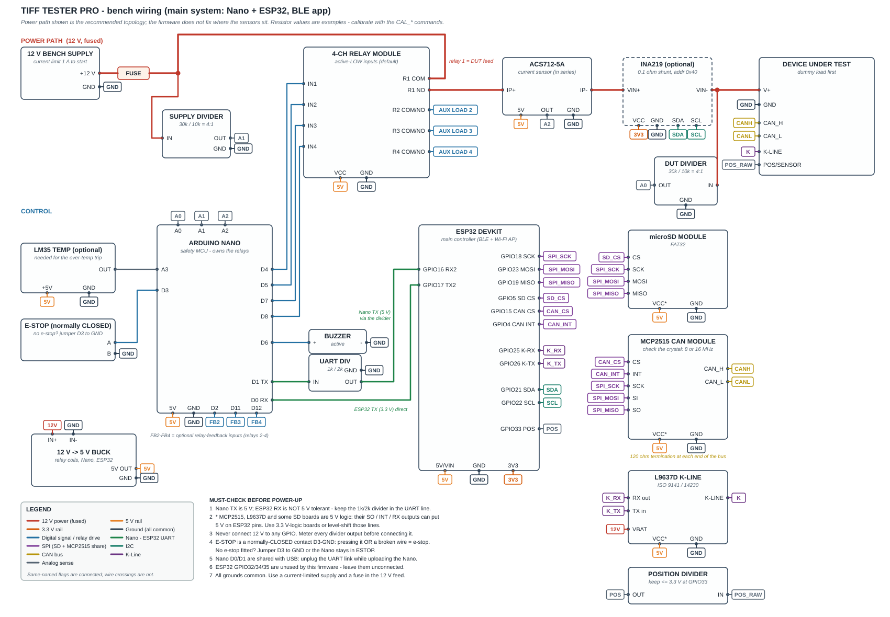
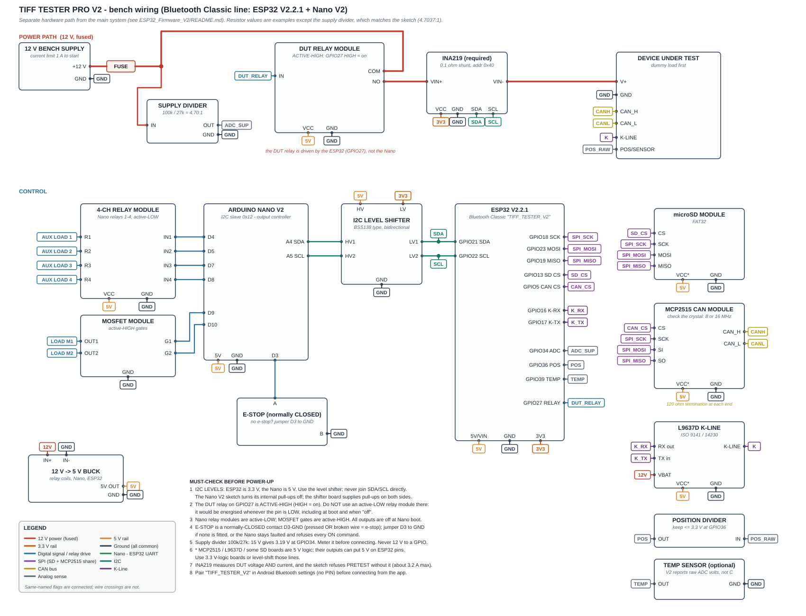

# Bench wiring diagrams

Two separate bench builds, each with its own diagram and connection table:

| Build | Diagram | Firmware |
|---|---|---|
| **Main system** (Nano + ESP32, BLE app) | [WIRING_MAIN.svg](WIRING_MAIN.svg) | `Arduino_Nano_Safety/` + `ESP32_Firmware/` |
| **V2 line** (Bluetooth Classic, I2C Nano) | [WIRING_V2.svg](WIRING_V2.svg) | `Arduino_Nano_V2/` + `ESP32_Firmware_V2/` |

Pick one - they are different hardware paths and do not share a Nano/ESP32 pin
map. Pin numbers come straight from the sketches; the power-path topology and
resistor values are **recommendations** the firmware does not enforce (called out
below). Nothing here has been verified on real hardware - run
[BRINGUP_CHECKLIST.md](BRINGUP_CHECKLIST.md) as you build it.

**Printing:** open the SVG in a browser and print landscape on A3, or zoom in on
screen. In the diagrams, **same-named flags are the same wire**; wire crossings
are not connections. All grounds are common.

---

## 1. Main system



### 1.1 12 V power path (recommended topology)

```
12 V supply (+) -> fuse -> [node 12V] -> relay 1 COM
                                     \-> supply divider -> Nano A1
relay 1 NO -> ACS712 IP+ ; ACS712 IP- -> [INA219 VIN+ ; VIN-] -> [node DUT+] -> DUT V+
                                                                    \-> DUT divider -> Nano A0
12 V supply (-) -> common ground
```

- The DUT only ever receives power through relay 1.
- The INA219 is optional. Without it, ACS712 IP- goes straight to the DUT node.
- The firmware does not fix where the sensors sit. This order measures **DUT**
  current/voltage (after the relay) and **supply** voltage (before it).

### 1.2 Connection table

**Analog sensing (Nano)**

| From | To | Notes |
|---|---|---|
| Supply divider OUT | Nano **A1** | 30k top / 10k bottom = 4:1 (firmware default `SUPPLY_DIVIDER` 4.0); 15 V -> 3.75 V |
| DUT divider OUT | Nano **A0** | same ratio (`DUT_DIVIDER` 4.0) |
| ACS712 OUT | Nano **A2** | ACS712-5A: ~2.5 V at zero, 185 mV/A |
| LM35 OUT (optional) | Nano **A3** | 10 mV/°C, powered from 5 V; only needed for the over-temperature trip |

Divider values are examples that give the ratio the firmware assumes; calibrate
with the `CAL_*` commands either way.

**Relay module and outputs (Nano)**

| Nano pin | To | Notes |
|---|---|---|
| D4 | Relay module IN1 | relay 1 = DUT feed |
| D5 | IN2 | relay 2 (aux) |
| D7 | IN3 | relay 3 (aux) |
| D8 | IN4 | relay 4 (aux) |
| D3 | E-stop | **normally-closed contact between D3 and GND** (pressed *or* broken wire = e-stop). No e-stop fitted: jumper D3 to GND. |
| D6 | Active buzzer + | other side to GND; for a buzzer drawing more than a few mA use a transistor |
| D13 | (on-board LED) | no wiring |
| D2 / D11 / D12 | Optional relay-2/3/4 feedback | only with `AUX_FEEDBACK_ENABLED 1` |
| 5V / GND | Relay module VCC / GND, ACS712, LM35 | supply from the 5 V rail below, **not** a Nano pin, for the relay coils |

Relay module: active-LOW inputs (the default polarity); R1 COM/NO carry the DUT
feed, R2-R4 COM/NO go to whatever bench loads you are switching.

**Nano <-> ESP32 UART (115200)**

| From | To | Notes |
|---|---|---|
| Nano **D1 (TX)** | divider IN | **5 V signal** - must be reduced for the ESP32 |
| Divider OUT | ESP32 **GPIO16 (RX2)** | 1k in series, 2k to GND = 3.33 V |
| ESP32 **GPIO17 (TX2)** | Nano **D0 (RX)** | 3.3 V into a 5 V input is fine |
| GND | GND | common |

### 1.3 ESP32 peripherals

| Peripheral | Pin | ESP32 pin |
|---|---|---|
| SPI SCK (SD + MCP2515, shared) | SCK | **GPIO18** |
| SPI MOSI | MOSI / SI | **GPIO23** |
| SPI MISO | MISO / SO | **GPIO19** |
| microSD | CS | **GPIO5** |
| MCP2515 CAN | CS | **GPIO15** |
| MCP2515 CAN | INT | **GPIO4** (wired, not used by the firmware yet) |
| L9637D K-Line | RX out | **GPIO25** |
| L9637D K-Line | TX in | **GPIO26** |
| INA219 (optional) | SDA / SCL | **GPIO21 / GPIO22**, address 0x40, 3.3 V |
| Position input | via divider | **GPIO33**, 0-3.3 V only |
| Status LED | - | GPIO2 (on-board) |

Not used by this firmware, leave unconnected: GPIO32, GPIO34, GPIO35.

CAN: MCP2515 CAN_H / CAN_L go to the DUT's CAN pins (or your analyser), with
**120 Ω termination at each end** of the bus. **Read the crystal printed on the
MCP2515 board (8 or 16 MHz)** and set it in the app - the default is 8 MHz.

K-Line: L9637D VBAT to the 12 V node, K-LINE to the DUT's K-Line pin.

### 1.4 Power tree (recommended)

One 12 V -> 5 V buck converter feeds the relay-module coils, the Nano 5 V pin,
the ESP32 5V/VIN pin, the ACS712, LM35 and the 5 V module supplies. The ESP32's
3V3 pin feeds the INA219. Use USB only for programming, and check your boards
before connecting USB and the buck together (most dev boards have a diode on the
5 V input, but not all). Relay coils can draw ~70 mA each - do not run them from
a USB-powered Nano's 5 V pin.

### 1.5 Must-check before power-up

1. **UART level.** Nano TX is 5 V and the ESP32 is not 5 V tolerant. Keep the 1k/2k divider.
2. **5 V-logic modules.** Many MCP2515 (TJA1050) boards, L9637D circuits and some SD
   boards run at 5 V: their SO / INT / RX outputs can put **5 V on ESP32 pins**. Use
   3.3 V-logic boards or level-shift those lines. The firmware cannot tell you this
   is wrong; check each board's documentation and with a meter.
3. **Never 12 V on a GPIO.** Meter every divider output before connecting it.
4. **E-stop contact type** is normally-CLOSED to GND. A normally-open button wired the
   old way will read as "pressed" forever.
5. **Nano D0/D1 are shared with USB.** Unplug the UART link while uploading the Nano.
6. **Common ground** everywhere; current-limited supply and a fuse in the 12 V feed.

---

## 2. V2 line



### 2.1 Differences from the main system

- The **DUT relay is on the ESP32 (GPIO27, active-HIGH)**, not the Nano.
- The Nano V2 is an **I2C slave (0x12)** that drives four relays and two MOSFETs.
- The **INA219 is required** (voltage and current both come from it; `PRETEST` fails without it).
- Supply voltage uses a **100k / 27k divider** into GPIO34 (the sketch's ratio is 4.7037).
- No ACS712, LM35 or UART link.

### 2.2 Power path

```
12 V supply (+) -> fuse -> [node 12V] -> DUT relay COM
                                     \-> supply divider (100k/27k) -> ESP32 GPIO34
DUT relay NO -> INA219 VIN+ ; INA219 VIN- -> DUT V+
```

### 2.3 Connection table

| From | To | Notes |
|---|---|---|
| ESP32 **GPIO27** | DUT relay module IN | **active-HIGH.** An active-LOW module here would be energised whenever the pin is LOW, including at boot. |
| Supply divider OUT | ESP32 **GPIO34** | 100k top / 27k bottom: 12 V -> 2.55 V, 15 V -> 3.19 V |
| ESP32 **GPIO21 / GPIO22** | Level shifter LV1 / LV2 | I2C, 3.3 V side; INA219 also sits on this side |
| Level shifter HV1 / HV2 | Nano **A4 (SDA) / A5 (SCL)** | I2C, 5 V side |
| Level shifter HV / LV | 5 V / 3.3 V | BSS138-type bidirectional shifter, common ground |
| Nano **D4 / D5 / D7 / D8** | 4-ch relay IN1-IN4 | Nano relays 1-4, active-LOW |
| Nano **D9 / D10** | MOSFET module G1 / G2 | active-HIGH |
| Nano **D3** | E-stop | normally-CLOSED contact to GND; no e-stop: jumper to GND |
| ESP32 **GPIO18 / 23 / 19** | SD + MCP2515 SCK / MOSI / MISO | shared SPI |
| ESP32 **GPIO13** | microSD CS | |
| ESP32 **GPIO5** | MCP2515 CS | (INT not used) |
| ESP32 **GPIO16 / GPIO17** | L9637D RX out / TX in | K-Line |
| ESP32 **GPIO36** | Position input via divider | 0-3.3 V only |
| ESP32 **GPIO39** | Temperature sensor (optional) | the V2 sketch reports the raw ADC voltage, not °C |

### 2.4 Must-check before power-up

1. **I2C levels:** ESP32 is 3.3 V, the Nano is 5 V. Use the shifter. The Nano V2 sketch turns its internal pull-ups off; the shifter board provides pull-ups on both sides. Never join SDA/SCL directly.
2. **DUT relay polarity** (item above): active-HIGH only.
3. **E-stop:** normally-closed to GND, or jumpered. With `ENABLE_ESTOP 1` and nothing on D3 the Nano stays faulted and refuses every ON command.
4. **5 V-logic modules** on the ESP32 side (MCP2515, L9637D, some SD boards): same caution as the main system.
5. **INA219 range:** about 3.2 A with a 0.1 Ω shunt.
6. **Pair `TIFF_TESTER_V2`** in Android Bluetooth settings (no PIN) before connecting from the app.

---

## 3. Editing the diagrams

The SVGs are generated. Edit and re-run:

```bash
cd Documentation/diagrams
python make_main.py     # writes ../WIRING_MAIN.svg
python make_v2.py       # writes ../WIRING_V2.svg
```

`svgkit.py` holds the symbol helpers (boxes with named pins, wires with junction
dots, net-label flags). If you change a pin in firmware, change it in the
generator and in the tables above.
